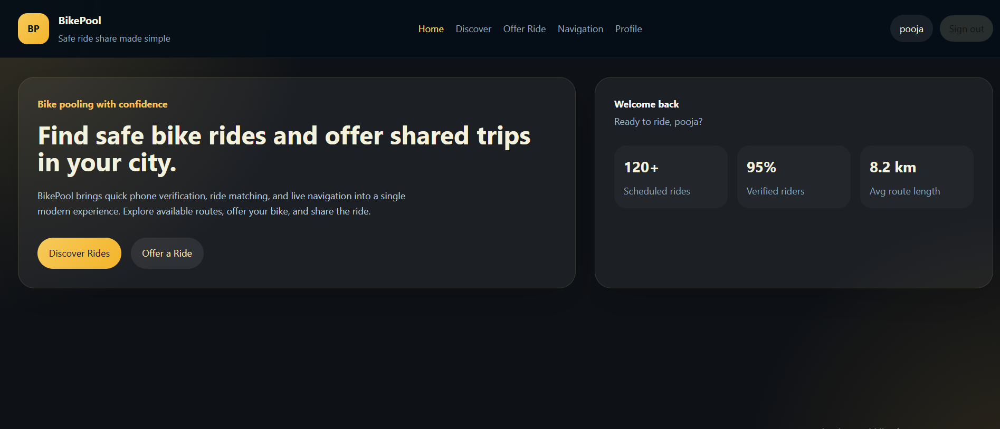
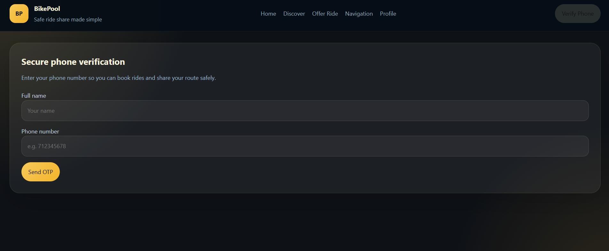
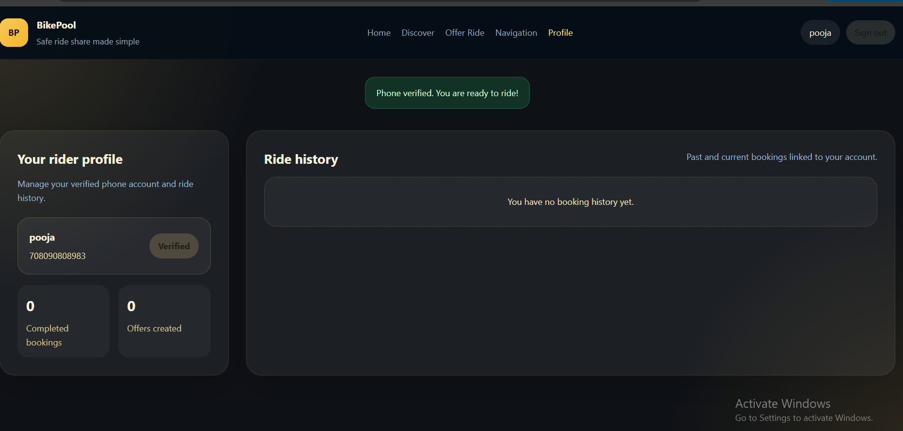
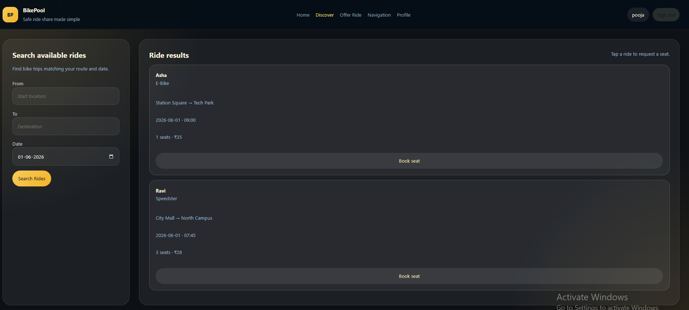
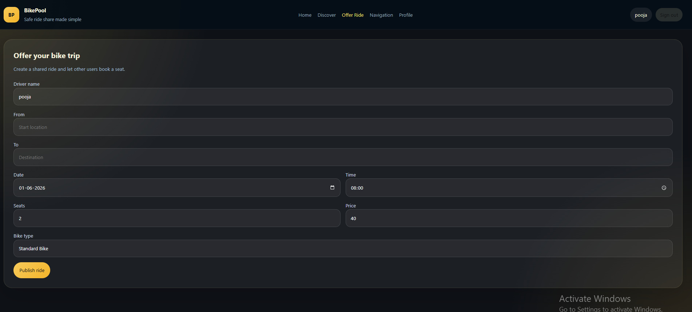
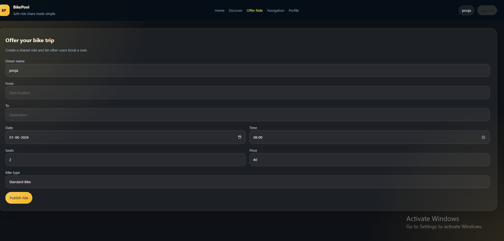
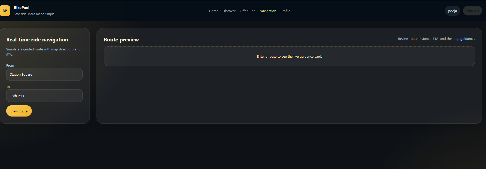
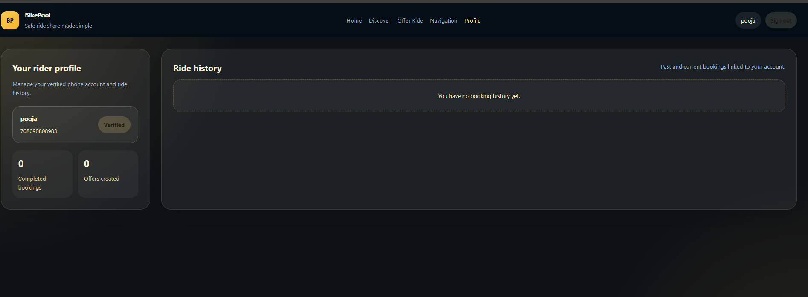

# Bike Pooling System

A bike ride-sharing platform built with React, Vite, and Express.

## Features
- Phone verification with OTP simulation
- Search and book shared bike rides
- Offer new bike rides for other users
- Live route navigation simulation
- REST API backend running on Express

## Run locally
1. Install dependencies:
   ```bash
   npm install
   ```
2. Start the frontend app:
   ```bash
   npm run dev
   ```
3. Start the backend server in a separate terminal:
   ```bash
   npm run server
   ```

Frontend: http://localhost:3000
Backend: http://localhost:4000

## Notes
- The backend now uses a persistent `db.json` file so rides, users, and bookings survive restarts.
- OTP responses are shown in the UI for demo verification.
















